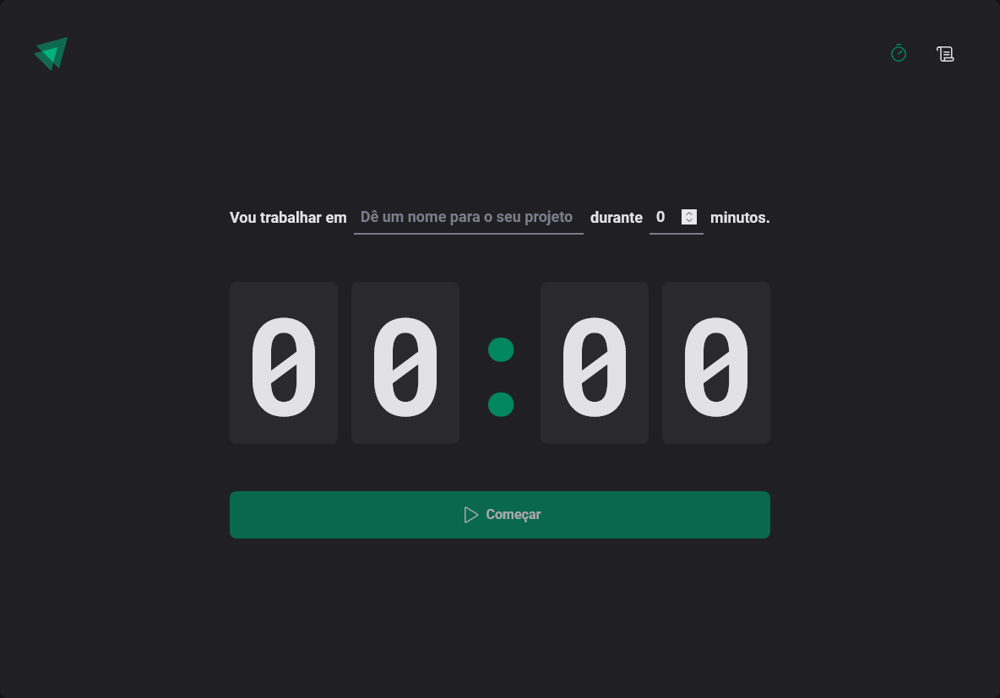

<p align="center">
  
</p>

<h1 align="center">Ignite Timer</h1>
<p align="center">Simple "pomodoro" app developed while following Rocketseat's React course.</p>

## Preview



## Project Setup

```sh
npm install
```

### Compile and Hot-Reload for Development

```sh
npm run dev
```

### Type-Check, Compile and Minify for Production

```sh
npm run build
```
